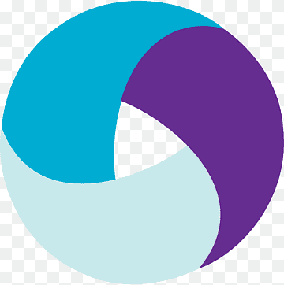
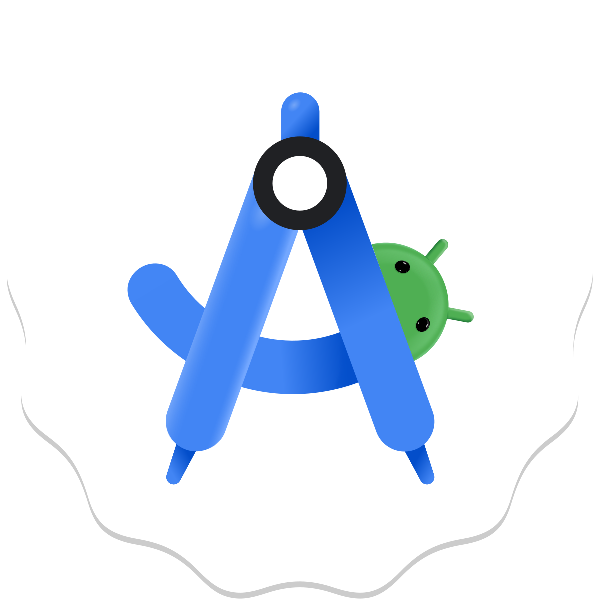

<h1>Hello, I`m <a href="(https://github.com/irinamolodtsova)" target="_blank">Irina</a> 
</h1>
<h3>I am a QA Engineer (Manual, Automation - Java)</h3>

- 🌍 I speak Russian (native), English (B2)
- 📫 How to reach me irinamolodtsovabusiness@gmail.com or @IrinaSharkies (Telegram)
- 💻 A little about experience: I am working as a Manual QA since 2022, since 2024 took AQA Java classes and started to write auto-tests using Java - Selenide

### I use:

### My projects for [qa.guru](https://qa.guru/) (AQA Java courses)

[School Project UI for LevelTravel company](https://github.com/irinamolodtsova/diploma_ui_qaguru)

[School Project API Tests](https://github.com/irinamolodtsova/diploma_qa_guru_restassured)

[School Project Mobile Automation Tests](https://github.com/irinamolodtsova/qa_guru_mobile_diploma)

